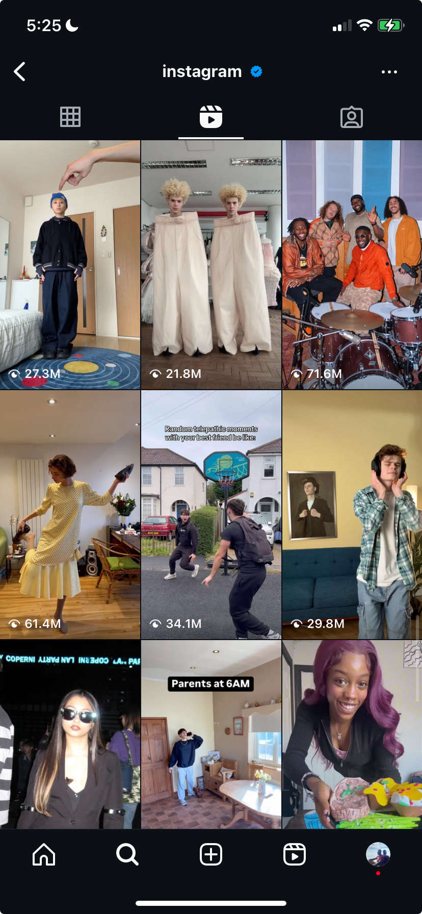

# Instagram Reels Profile Grid

### Overview

The goal of this test is to replicate the functionality demonstrated in the provided screen recording (derived from Instagram profile reels). You will build this functionality using **SwiftUI** combined with **UIKit** via UIViewRepresentable. The app will use 13 sample videos stored locally.

### Walkthrough Video
To help you get started, please watch the walkthrough video below which highlights key aspects of the task:

### Functionality Requirements

1. **Fullscreen Expansion & Playback:**  
   - Tapping a video from the grid expands the selected view to fullscreen and automatically starts playback.

2. **Dismissal Gesture:**  
   - Allow dragging from the left on the expanded fullscreen view to initiate dismissal.

3. **TabView-like Scrolling & Background Effect:**  
   - Implement scrolling similar to a TabView within the expanded view.
   - The card in the background grid corresponding to the currently focused video should dim (go black).

4. **Snap-to-Card Dismissal:**  
   - When the expanded view is dismissed by dragging and releasing, it should smoothly snap back to its exact position in the grid.

5. **Grid Auto-scroll:**  
   - If the associated card in the grid isn't currently visible (e.g., offscreen at the bottom), automatically scroll the grid to bring it into view upon dismissal.

### Evaluation Criteria

You will be assessed based on:

- **Design & Conformance**  
- **Smoothness of Transitions**  
- **Code Organization & Clarity**

### Resources

- **Design Guidelines:**  
  Review the design specifications here: [Figma Design Guidelines](https://www.figma.com/design/sTaho4kTFib0OmS5Q1H3pd/Full-Stack-Test)

- **AI Models & Documentation:**  
  Use any LLM provider of your choice. Research API documentation and sample projects to integrate AI features effectively.

- **Help:**  
  You are encouraged to leverage AI models, Stack Overflow, or other resources. Your resourcefulness matters, and the end result is most important!

### Submission Instructions

1. **Repository:**  
   Create your own GitHub repository for the project.

2. **Submission Details:**  
   Send a WhatsApp DM to **+1 803 387 6281** containing:
   - The URL of your GitHub repository.
   - Your full name.

3. **Talent Profile Requirement:**  
   Complete your talent profile sign-up on [gigsama.com](https://gigsama.com) **before** submitting your project.

- **Deadline:**  
  **Monday, March 24, 12:59 PM GMT**

---

For any questions or clarifications, reach out via WhatsApp at **+1 803 387 6281**.

Good luck!